# Docker Traefik

# Autores
**Diego Alejandro Gil Otálora** Cod:202222152<br>
**Julian David Bocanegra Segura** Cod: 202220214  
Universidad Pedagógica y Tecnológica de Colombia  
Ingeniería de Sistemas y Computación - Sistemas Distribuidos  
Tunja, 2025 


# Punto 1 - Topología y redes

Para esto se modificó la red en el `docker-compose.yml` para que traefik, api (réplicas), neo4j vivan en una aplicación de red única

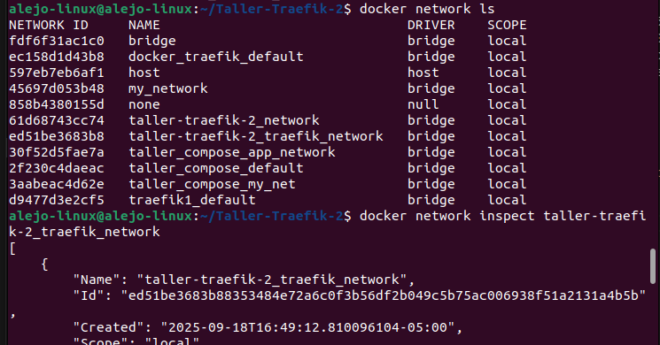

Además se comprueba que Neo4J ya no es accesible desde el host

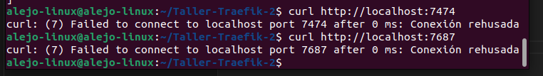

- **Red única**: `traefik_network` (bridge)
- **Servicios en la red**: traefik, backend, neo4j
- **Neo4j**: NO expuesto al host, solo acceso interno via DNS

# Punto 2 - Rutas Estructuradas

Editamos /etc/hosts

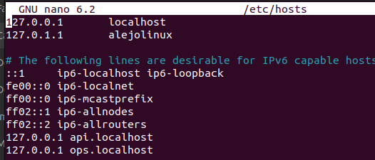

Configuramos hosts

- **API**: http://api.localhost/
- **Dashboard**: http://ops.localhost/dashboard/

Comprobamos

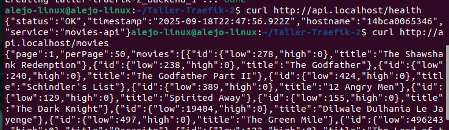


# Punto 3 - Middlewares

Primero instalamos htpasswd
`sudo apt-get update` y
`sudo apt-get install apache2-utils`

Generamos el hash con usuario: `admin` y contraseña:`admin`
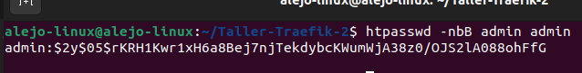

Modificamos el `docker-compose.yml` poniendo los labels para Basic Auth y rateLimit. En este caso ponemos `average=5` y `burst=10` para que maneje 5 pteciones por segundo y 10 de golpe.

```
labels:
  - "traefik.http.routers.dashboard.rule=Host(`ops.localhost`) && PathPrefix(`/dashboard`)"
  - "traefik.http.routers.dashboard.middlewares=dashboard-stripprefix"
  - "traefik.http.middlewares.dashboard-stripprefix.stripprefix.prefixes=/dashboard"
```

```
labels:
  - "traefik.http.routers.api.middlewares=rate-limit"
  - "traefik.http.middlewares.rate-limit.ratelimit.average=5"
  - "traefik.http.middlewares.rate-limit.ratelimit.burst=10"
```
### Comprobaciones

Comprobamos que para acceder al dashboard pide credenciales
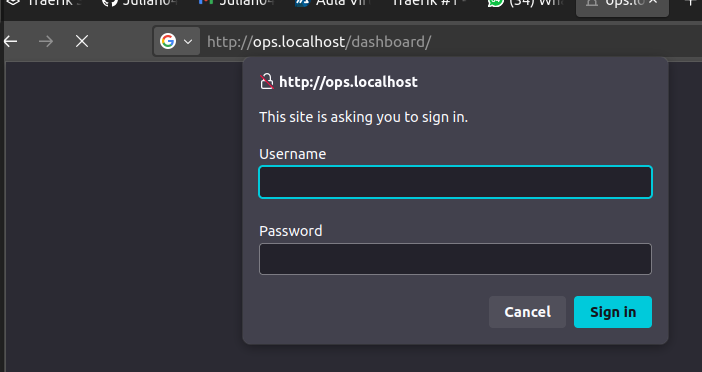

Comprobamos que recibe 10 peticiones de golpe, desde 11 da el codigo 429 `Too Many Requests`

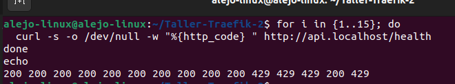


# Punto 4 - Balanceo (Replicas de la API)

Para este ejercicio usamos el metodo `--scale`

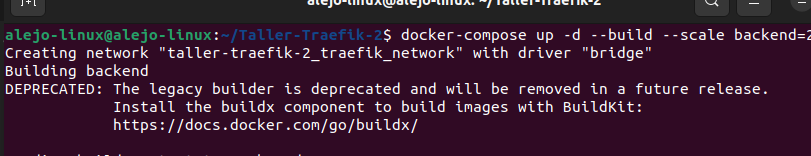

Comprobamos

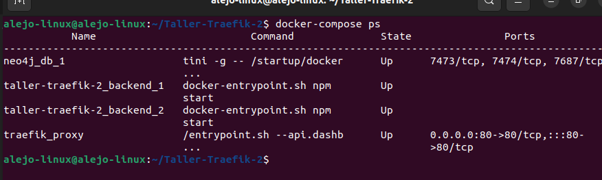
Se evidencian las replicas `taller-traefik-2_backend_1` y `taller-traefik-2_backend_2`

Hacemos un Test 
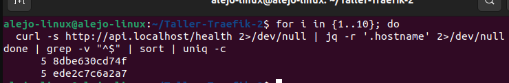
La Replica 1 recibio 5 peticiones y la replica 2 recibio otras 5 peticiones

- Logs en cada replica
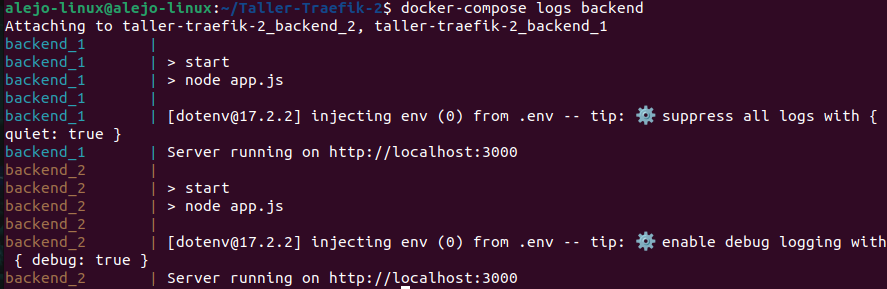


# Punto 5 - Descubrimiento automatico

Antes de escalar (ya tenenemos dos replicas corriendo)
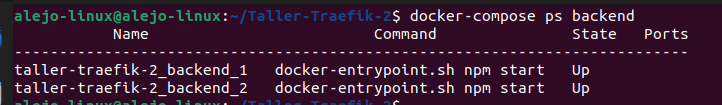

Primero escalamos a 1 replica y luego a 3 (sin hacer `docker-compose down` ni parar servcios)

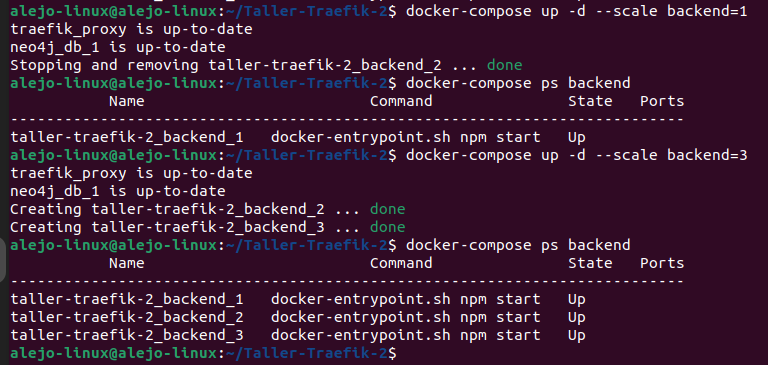

Dashboard evidenciando que `load balancer` tiene los 3 servidores registrados

### Labels usados

```
traefik:
  command:
    - --providers.docker=true
    - --providers.docker.exposedbydefault=false
    - --providers.docker.network=traefik_network

backend:
  labels:
    - "traefik.enable=true" 
    - "traefik.http.routers.api.rule=Host(`api.localhost`)"
    - "traefik.http.routers.api.service=api-service"
```


# Punto 6 - Observabilidad y pruebas

;;;;


# Reflexion tecnica

- Qué aporta Traefik frente a mapear puertos directamente?
 R/ Cuando se mapea con puertos directos cada servcio tiene un puerto distinto, se puede complicar si son muchos. Con Traefik existe un solo punto de entrada, además de rutas limpias 

- ¿Qué middlewares usarían en producción y por qué?
R/ Usaríamos RateLimit ya que evita abusos sobre los servicios y sobrecarga de servidor. Ademas usariamos BasicAuth para proteger accesos internos.

- Riesgos de dejar el dashboard “abierto” y cómo mitigarlos.
R/ El riesgo es que cualquiera puede ver y atacar nuestra infraestructura. Se puede mitigar no exponiendolo en internet o con credenciales (auth)

